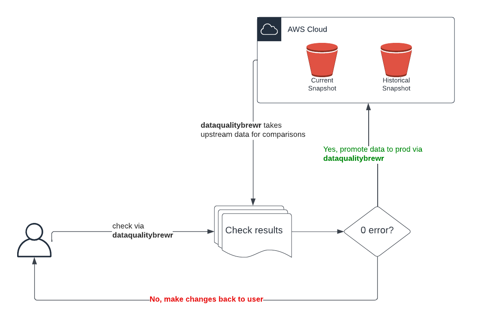

# DataBrew Data Quality Checker 
R package for testing metadata and interact with AWS

## Prerequisites

To fully run this package you will require access to DataBrew AWS Accounts via SSO (please contact atediarjo@gmail.com for access)

## Installation

Installation can be done through Github installation:

```r
devtools::install_github('databrew/dataqualitybrewr')
```

## Workflow



## FAQs


