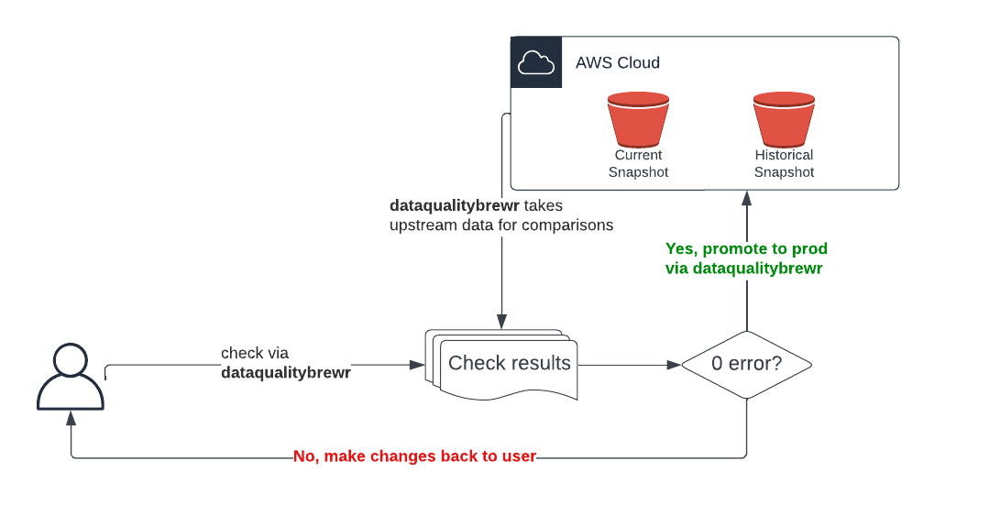

# DataBrew Data Quality Checker 
R package for testing metadata and interact with AWS

## Prerequisites

To fully run this package you will require access to DataBrew AWS Accounts via SSO (please contact atediarjo@gmail.com for access)

## Installation

Installation can be done through Github installation:

```r
devtools::install_github('databrew/dataqualitybrewr')
```

## Workflow



## How to Use

1. Check zip file submission
2. After running checks, you will get an output of a `check_result` object mapping
3. Pass `check_result` object mapping to promote function
4. Once passed, data will be uploaded to AWS as a current snapshot or historical snapshot (optional, but good to have)

## FAQs


